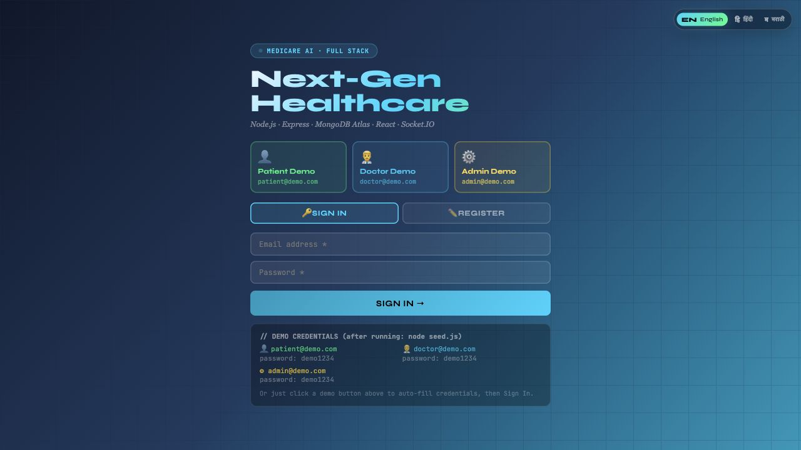
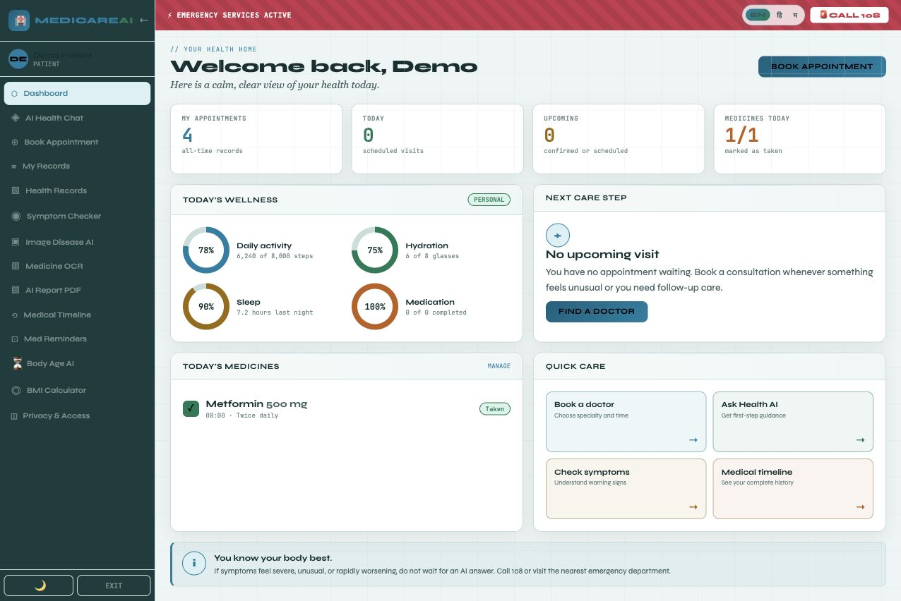
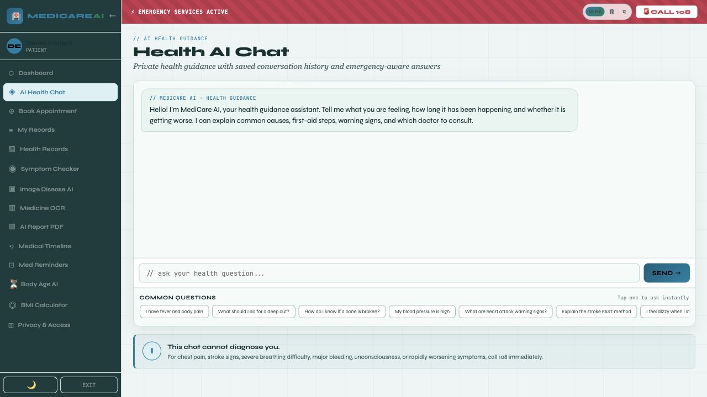
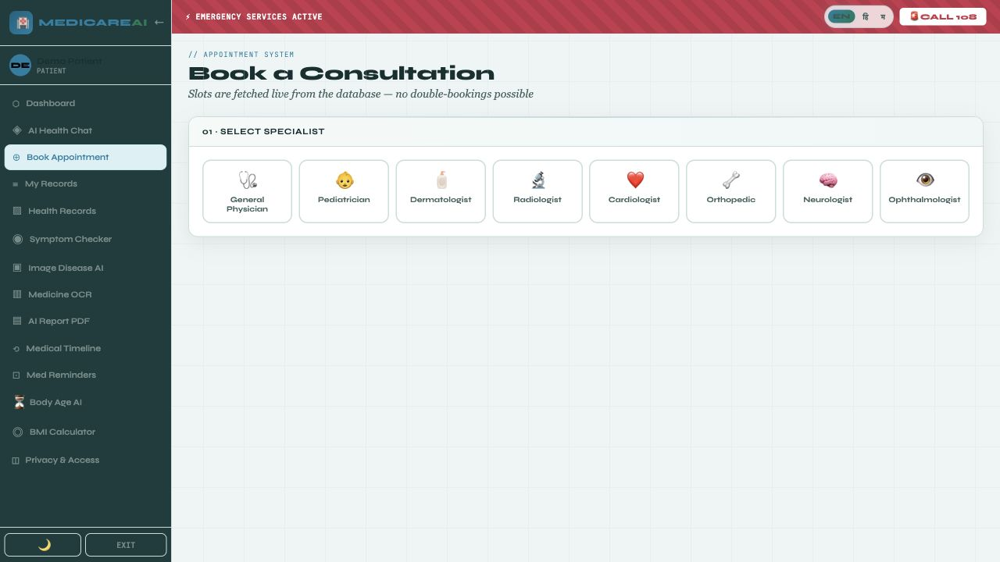
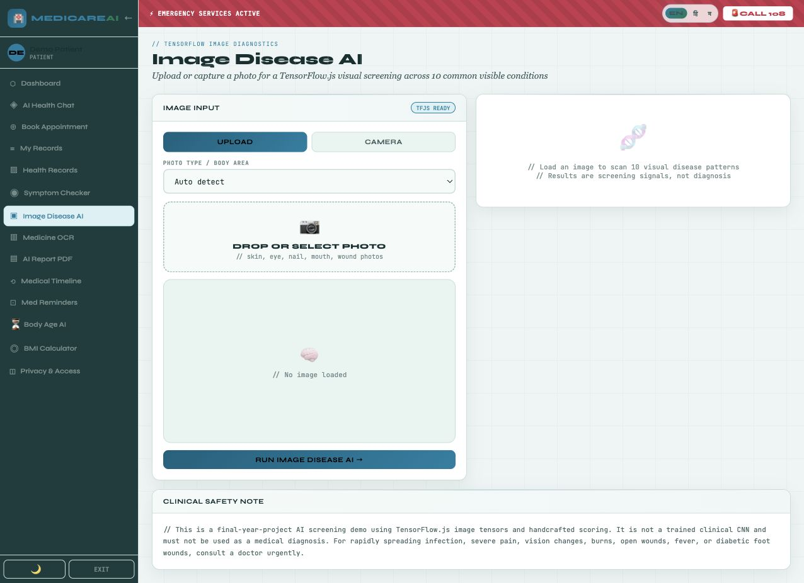
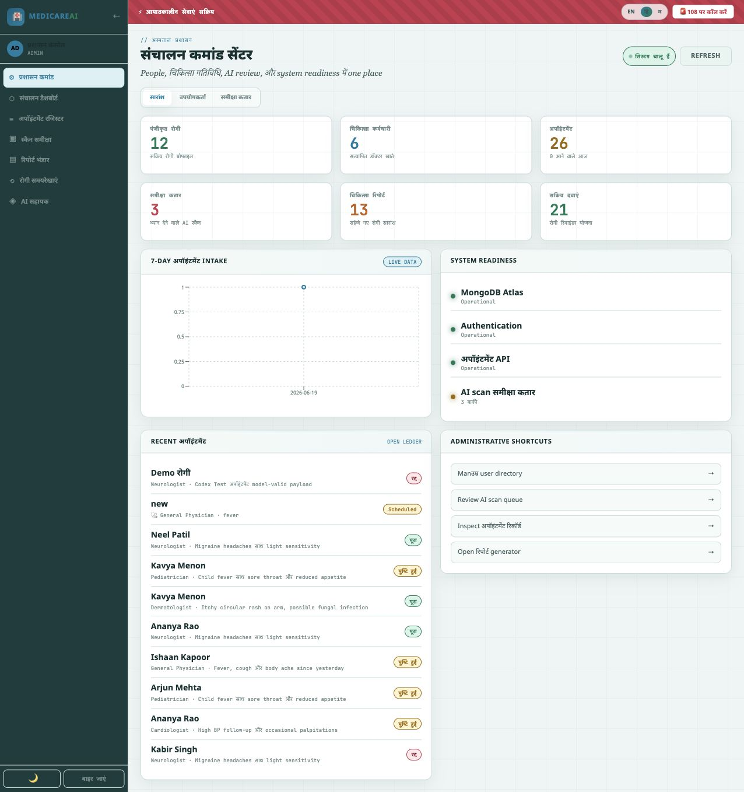

# Medicare.AI

Full-stack AI-assisted healthcare management platform with patient, doctor, and admin workflows.

## Structure

```text
MedicareAI-GitHub/
├── frontend/
├── backend/
├── ai-service/
├── github-screenshots/
├── README.md
└── .gitignore
```

## Tech Stack

- React, JavaScript, HTML, CSS
- Node.js, Express.js, MongoDB Atlas, Mongoose, JWT
- Python, FastAPI, Uvicorn
- TensorFlow.js, Tesseract.js, Socket.IO, jsPDF

## Main Features

- Patient, doctor, and admin login
- Appointment booking
- AI health chat
- Symptom checker
- Image disease screening
- Medicine OCR
- AI report PDF
- Medical timeline
- Health records
- Medicine reminders
- English, Hindi, Marathi language support

## Project Screenshots

### Login Page


### Patient Dashboard


### AI Health Chat


### Appointment Booking


### Image Disease AI


### Admin Panel


### Marathi Language Dashboard


### Hindi Language Dashboard


## Environment

Real .env files are not included. Use:

```text
backend/.env.example
ai-service/.env.example
```

## Demo Logins

```text
Patient: patient@demo.com / demo1234
Doctor: doctor@demo.com / demo1234
Admin: admin@demo.com / demo1234
```
